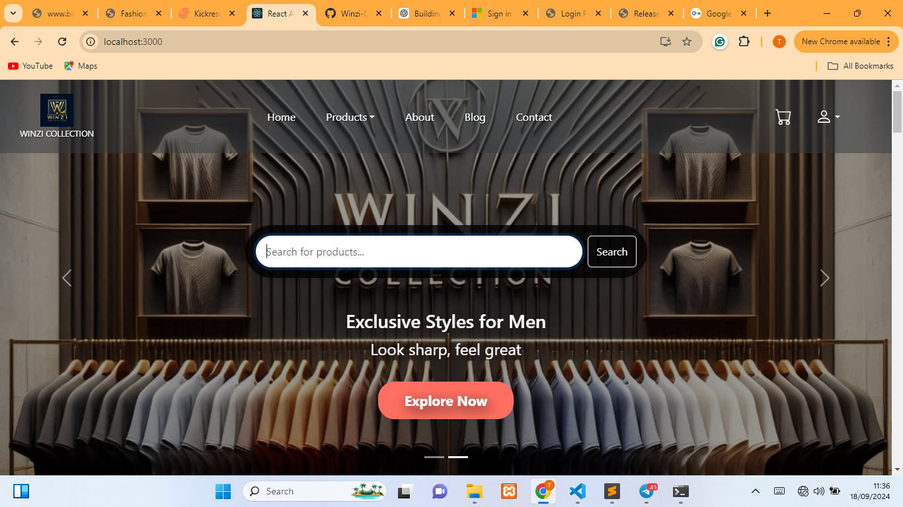
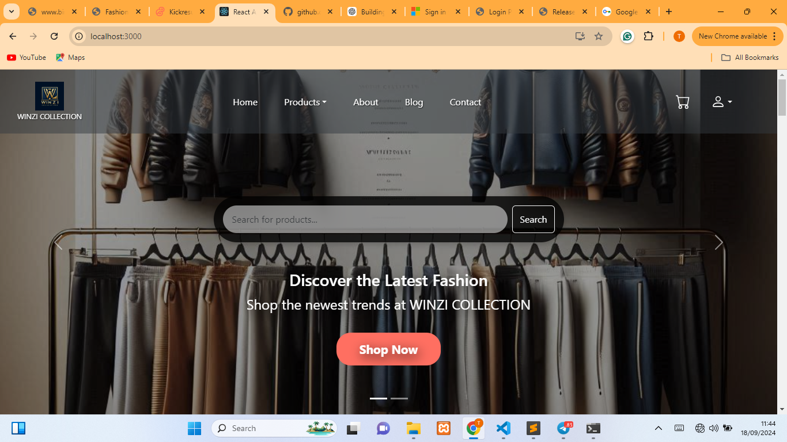
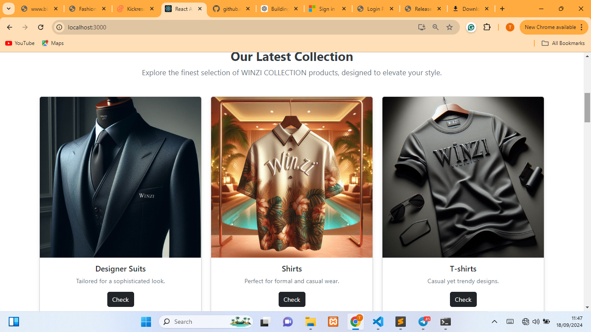
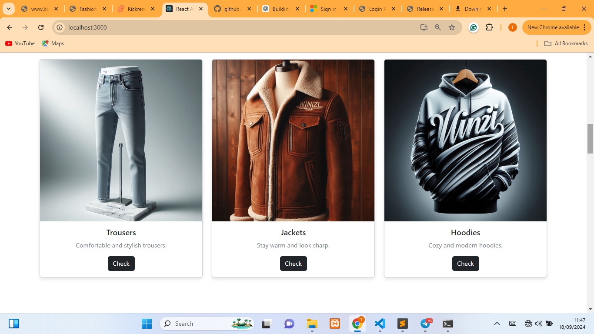
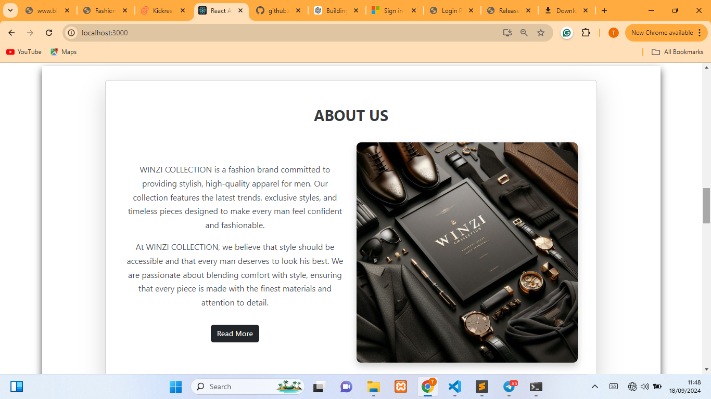
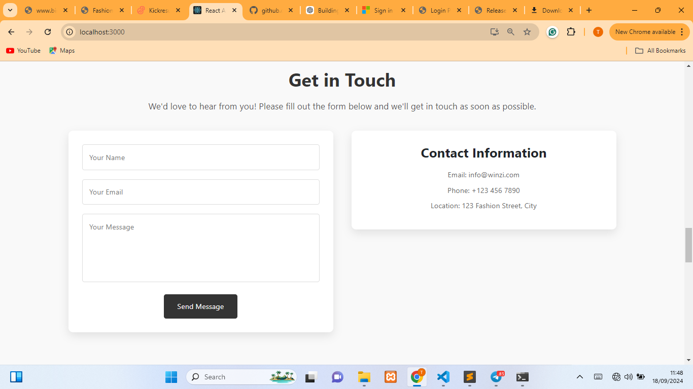
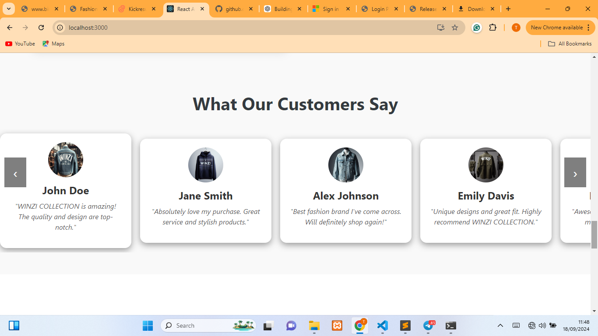
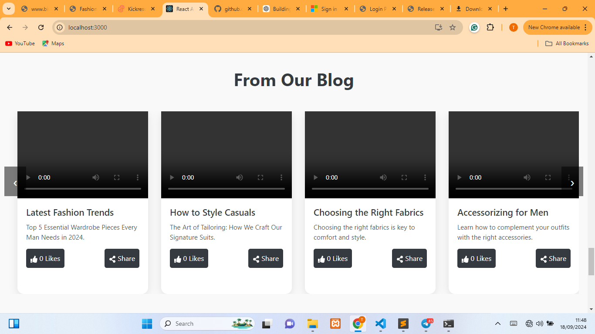
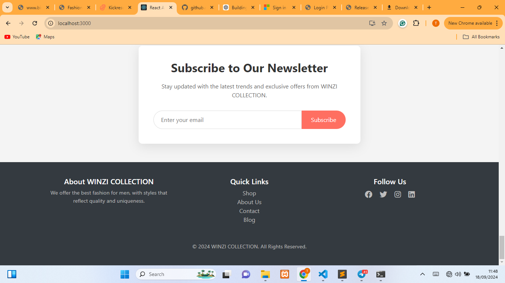

# Winzi Collection

Winzi Collection is a fashion brand website where users can shop for fashion products. The site is responsive and designed using react with a modern interface to deliver a smooth user experience.

## Features
- Professional, interactive and Responsive design that works on all screen sizes
- Hero Section with Carousel**: The hero section includes a carousel with two sliding sections.
- Fashion product listing and cart
- Simple Login/Signup form for users

  Future Enhancements:
- Back-end integration for shopping cart and product management
- Secure authentication system
- Product reviews and ratings

## Technologies Used
- **React**: JavaScript library for building user interfaces
- **CSS**: Styling for the webpage
- **Bootstrap**: Front-end framework for responsive design
- **Node Package Manager (NPM)**: For managing dependencies

## Setup and Installation

To run this project locally, follow these steps:

### Prerequisites
- Make sure you have [Node.js](https://nodejs.org/en/download/) installed.

### Installation
1. Clone the repository:
   git clone https://github.com/CodeCzar01/winzi-collection.git

2. Navigate to the project directory:
   cd winzi-collection

3. Install dependencies:
   npm install

4. Run the development server:
   npm start

Open your browser and go to http://localhost:3000.

License
This project is licensed under the MIT License.

Contact
For any inquiries or support, feel free to reach out via email: zionthompson528@gmail.com

### Screenshots

